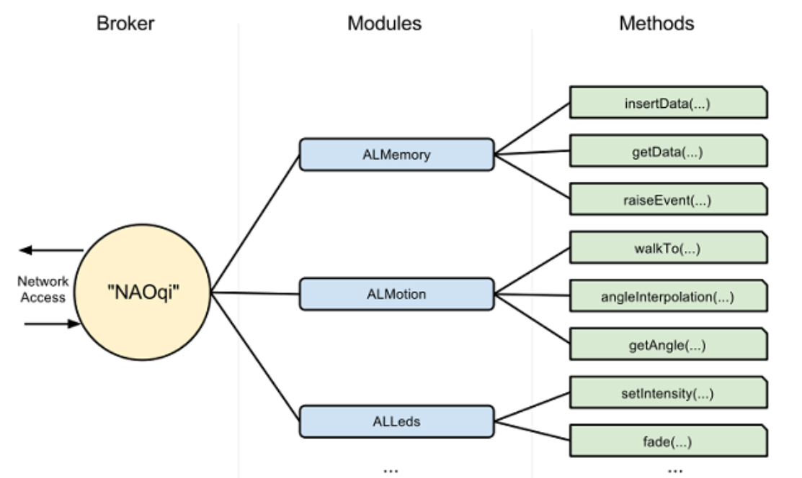

# Programando o Robô NAO

Este Repositório contém todos os códigos para programar o Robô NAO usando o Software Choregraphe.

## Guia Rápido de Instalação do Choregraphe

1. Baixar Choregraphe
Vá para o Softbank Robotics Developer Center

Crie uma conta ou faça login

Navegue até a seção "Downloads"

Baixe Choregraphe 2.8.x para seu sistema operacional (Windows/macOS)

2. Instalar Choregraphe

Windows:

Execute o arquivo .exe baixado

Siga o assistente de instalação

Aceite o contrato de licença

Escolha o diretório de instalação

macOS:

Abra o arquivo .dmg baixado

Arraste Choregraphe para a pasta Aplicativos

Inicie a partir dos Aplicativos

3. Configuração Inicial
Inicie Choregraphe

Conecte ao seu robô NAO:

Clique no botão "Connect"

Digite o endereço IP do robô

Porta padrão: 9559

Teste a conexão com a caixa "Say"

4. Configurar SDK Python (Opcional)

bash
#### Instalar NAOqi Python SDK

pip install caminho/para/naoqi-python-sdk.zip

5. Verificar Instalação
Crie um novo projeto

Arraste uma caixa "Say" para o diagrama

Digite texto e pressione "Play"

O robô deve falar o texto

## Solução de Problemas
Problemas de conexão: Verifique se robô e computador estão na mesma rede

Firewall: Permita Choregraphe através do firewall

Caminho Python: Defina o interpretador Python correto em Preferências

Seu robô NAO agora está pronto para programação!

## Visão Geral da API

 O NAOqi é mais que uma simples API, pois oferece um ecossistema completo para execução de módulos, bibliotecas e comportamentos do Robô. É um serviço multiplataforma e multilinguagem ofertado pela Aldebaran, com a qual podemos nos comunicar em linguagens como Python, java e c++. Do ponto de vista de vantagens, python acaba sendo mais simples pois não exige nenhum tipo de pré compilação do código. Sobre a API, ela atua como um broker, realizando a intermediação entre as chamadas do usuário e os módulos.

 O **NAOqi atua como uma ponte**, inteligando os **módulos** com os **métodos** disponíveis para execução.

Nesse contexto, o **NAOqi se comunica com os módulos que atuam como PROXY**, ou seja, procurador. Portanto, quando utilizarmos o módulo **ALMotion**, por exemplo, iremos **criar um objeto que contém todos os métodos disponíveis no ALMotion**.

## ORGANIZAÇÃO DOS MÓDULOS

1. Módulos Principais

Contém o funcionamento das classes básicas, explicação sobre como utilizar os métodos, todos os movimentos básicos, posturas, danças, etc...

2. Módulos de Visão

Contém a detecção facial, rastreamento de objetos, detecção de cores e outros códigos.

3. Módulos de Áudio

Aqui temos os módulos de áudio, testando reconhecimento de fala, síntese, processamento de som e efeitos de áudio.

4. Módulos de Memória

Métodos para enviar e receber dados da memória.

5. Comportamentos Complexos

Temos os códigos usados para testar saudação, navegação, demonstração interativa, rotinas educacionais e outros.

